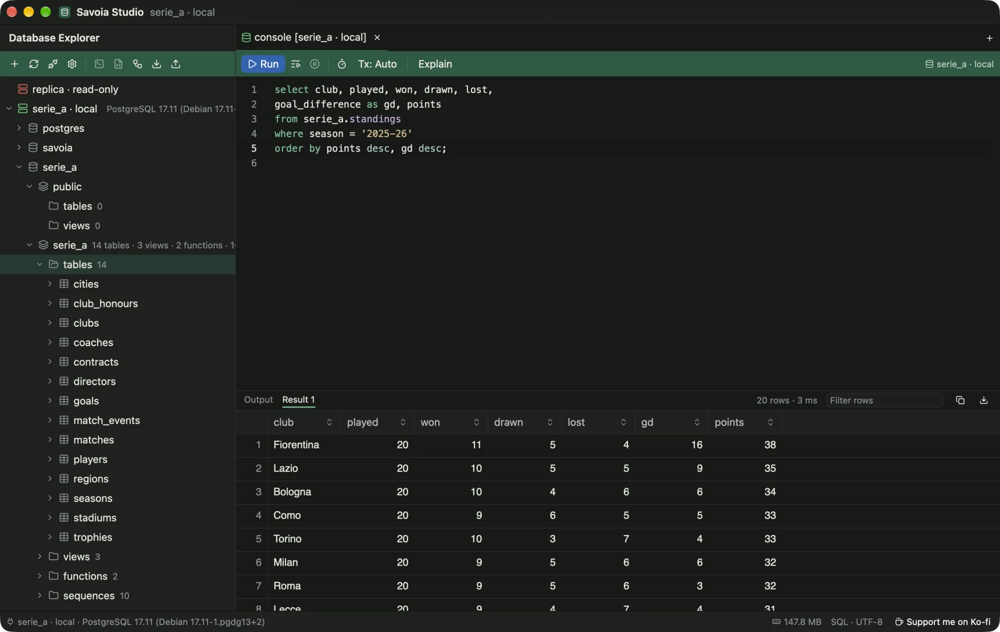
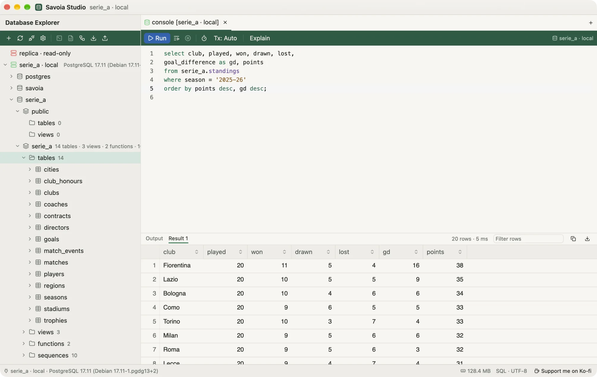

# Savoia Studio

Savoia Studio is a desktop database client for <strong>PostgreSQL</strong> and <strong>MySQL/MariaDB</strong>. It is written in Rust and draws its UI on the GPU, with no webview or JVM, so it starts fast and stays light on memory.

<figure class="shot wide">
  
  
  <figcaption>The main window: Database Explorer on the left, a console with its result grid on the right.</figcaption>
</figure>

  0
  
<strong>Free. No trial, no license key, no paid tier, no account.</strong>

  
Open source under MIT or Apache-2.0. If it saves you time, you can <a href="https://ko-fi.com/O5I528IC3A">support it on Ko-fi</a>.

## What you can do with it

- Explore schemas, tables, views and functions, with ER diagrams and DDL.
- Write SQL with schema-aware completion, run it statement by statement, and stream big results.
- Browse, filter, edit and join table data without writing SQL. Edits are reviewed as SQL before they commit.
- Dump and import whole schemas or single tables, with your installed client tools or the built-in engine.
- Connect through SSH tunnels and over TLS.

## Coming soon

Savoia speaks PostgreSQL and MySQL today. Support for more databases is on the way, free like everything else:

| Database | Status |
| --- | --- |
| PostgreSQL | Supported |
| MySQL | Supported |
| MariaDB | Works through a MySQL connection today; dedicated support coming |
| SQLite | Coming soon |
| SQL Server | Coming soon |
| MongoDB | Coming soon |

Want one sooner, or one that isn't listed? [Say so on GitHub](https://github.com/joaoGabriel55/savoia-studio/issues).

## Start here

<ul class="paths">
  <li><a href="install.html"><b>Install</b>Download for macOS, Windows or Linux.</a></li>
  <li><a href="connect.html"><b>Connect</b>Add a data source in one paste.</a></li>
  <li><a href="console.html"><b>Write SQL</b>Completion, running, results.</a></li>
  <li><a href="data-view.html"><b>Edit data</b>Change rows with a SQL preview.</a></li>
</ul>

The screenshots and recordings in these pages are of the real app, connected to a local PostgreSQL 17 with the Serie A sample database from the repository (`samples/`).
