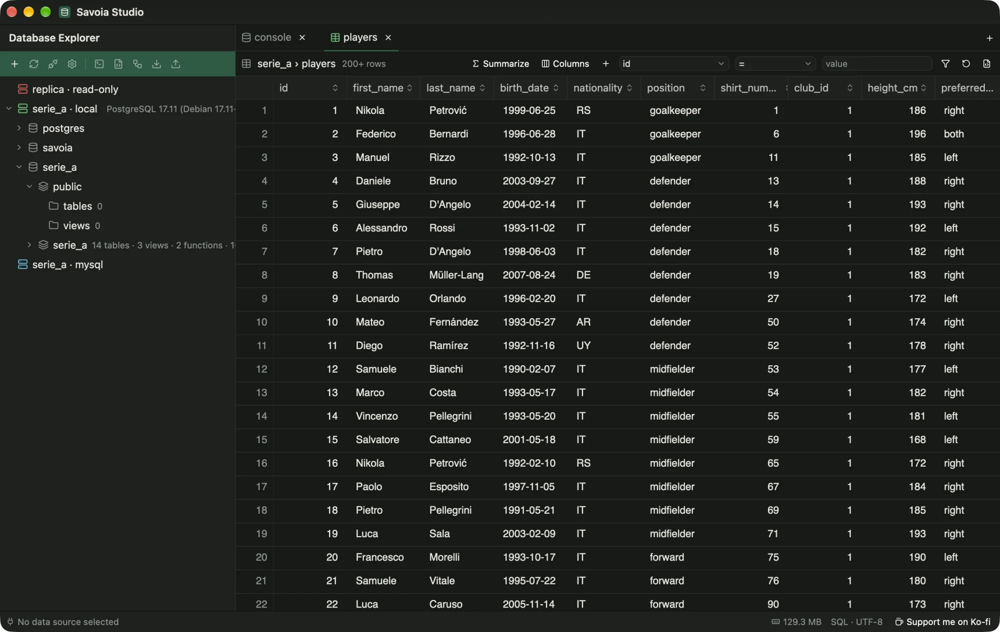

# Browse and edit data

Right-click a table and choose **Open data** to browse it without writing SQL.

<figure class="shot">
  
  <figcaption>The data view of <code>serie_a.players</code>.</figcaption>
</figure>

- Data loads in pages of 200 rows. A header click sorts on the server, and filter chips build the `WHERE` clause.
- **+ Column** adds values from related tables through foreign keys, or summaries of child rows (count, sum, min, max, avg, list). **Join another table…** covers relations the schema doesn't declare.
- **Summaries** group rows and aggregate them. *Save as query* opens the SQL in a console.
- **Edits.** Change cells, add rows or delete rows on tables with a key. Pending changes are highlighted. **Review SQL** shows the statements, **Commit** runs them in one transaction, and **Discard** drops them.
- **View SQL** or **Open in console** show the query behind the view.

<figure class="shot">
  <video poster="media/edit-review.webp" width="1200" height="486" autoplay muted loop playsinline preload="metadata" aria-label="Recording: two cells are edited, both rows are marked pending, and Review SQL shows BEGIN, two UPDATE statements and COMMIT.">
<source src="media/edit-review-m.mp4" type="video/mp4" media="(max-width: 640px)">
<source src="media/edit-review.mp4" type="video/mp4">
</video>
  <figcaption>Edit cells, then <strong>Review SQL</strong> before you <strong>Commit</strong>.</figcaption>
</figure>
