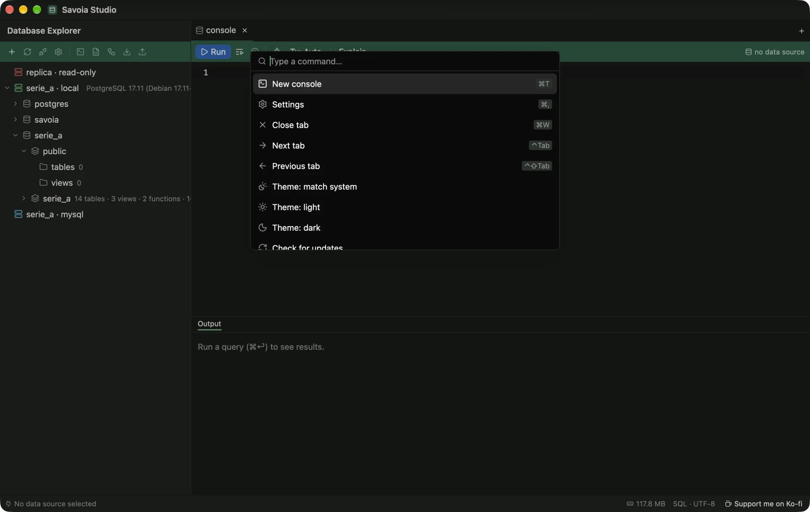

# Keyboard and command palette

**⌘⇧P** (Ctrl+Shift+P) opens the command palette. Type to filter it, and press ↩ to run the highlighted command. Every app-wide command is in the palette, with its shortcut beside it.

<figure class="shot">
  
  <figcaption>The command palette, with each command's shortcut.</figcaption>
</figure>

| Command | macOS | Windows, Linux |
| --- | --- | --- |
| Command palette | ⌘⇧P | Ctrl+Shift+P |
| New console | ⌘T | Ctrl+T |
| Settings | ⌘, | Ctrl+, |
| Close tab | ⌘W | Ctrl+W |
| Next tab / previous tab | ⌃⇥ / ⌃⇧⇥ | Ctrl+Tab / Ctrl+Shift+Tab |
| Run statement at the caret | ⌘↩ | Ctrl+Enter |
| Run whole script | ⌘⇧↩ | Ctrl+Shift+Enter |
| Quit | ⌘Q | Ctrl+Q |

**Settings › Keyboard** shows the same list in the app.
