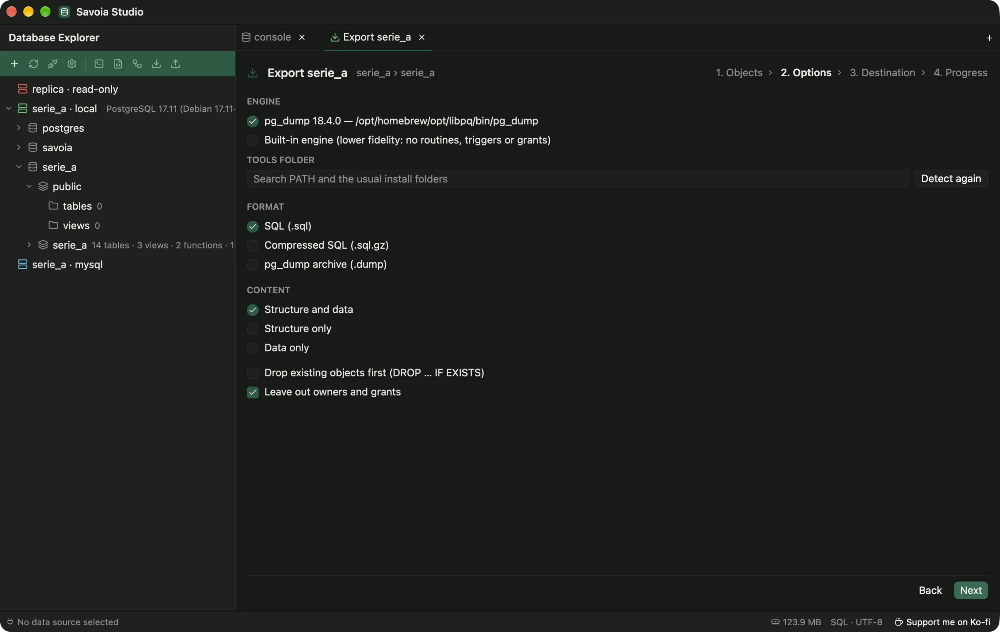

# Dump and import

Use **Dump…** and **Import…** on the explorer toolbar, or **Export…** and **Import…** on a table's menu.

<figure class="shot">
  
  <figcaption>The dump wizard found <code>pg_dump</code> on its own.</figcaption>
</figure>

Savoia uses the client tools you already have (`pg_dump`, `pg_restore`, `psql`, `mysqldump`, `mysql`). It finds them on `PATH` and in the usual install folders, such as Homebrew, Postgres.app and the EDB or Oracle installers. If yours live elsewhere, set the folder in **Settings › Dump tools**. `pg_dump` must be at least as new as the server, and Savoia warns when it isn't.

With no usable tool, the built-in engine writes plain SQL (optionally gzipped) or CSV from one consistent snapshot.

Imports run `.sql` scripts, including `$$` bodies and MySQL `DELIMITER` blocks, and CSV files with a column mapping. Dumps and imports work through SSH tunnels too.
